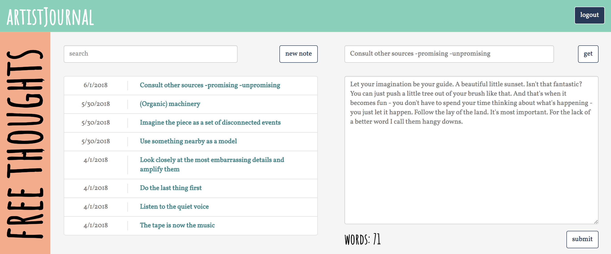
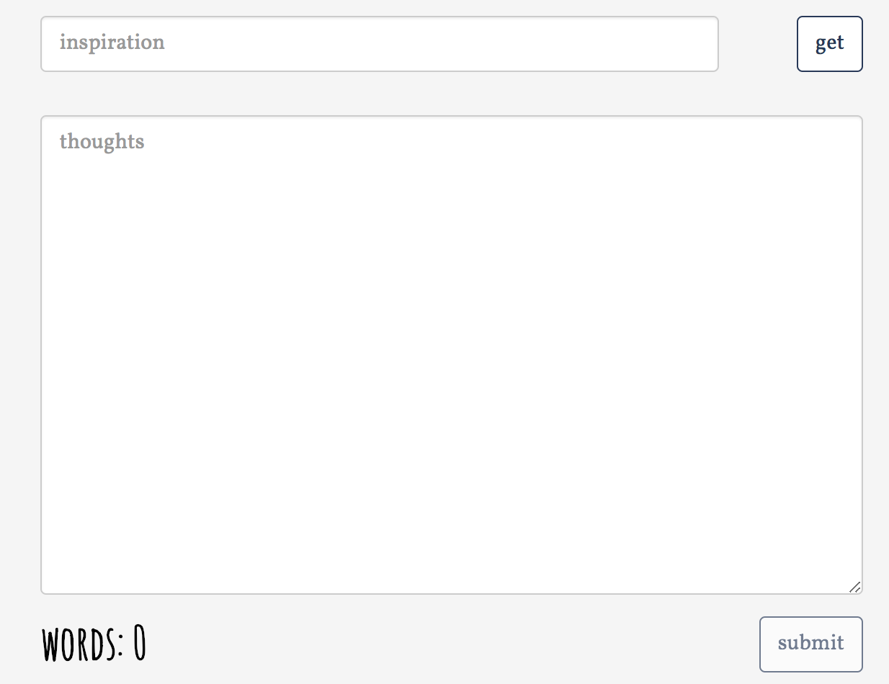
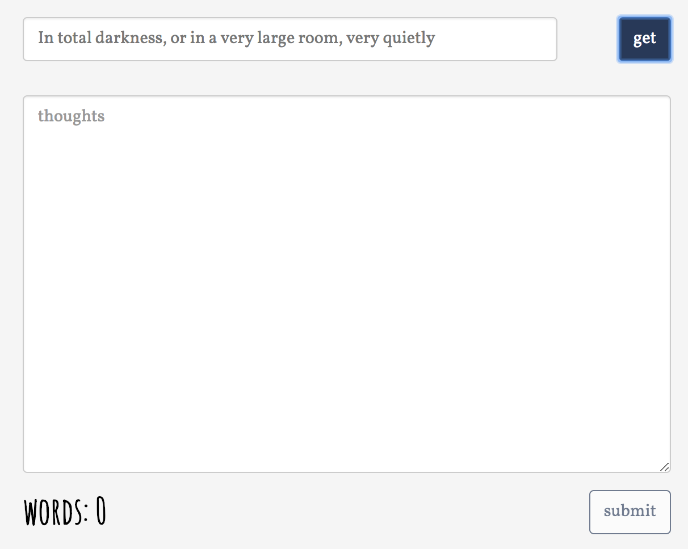
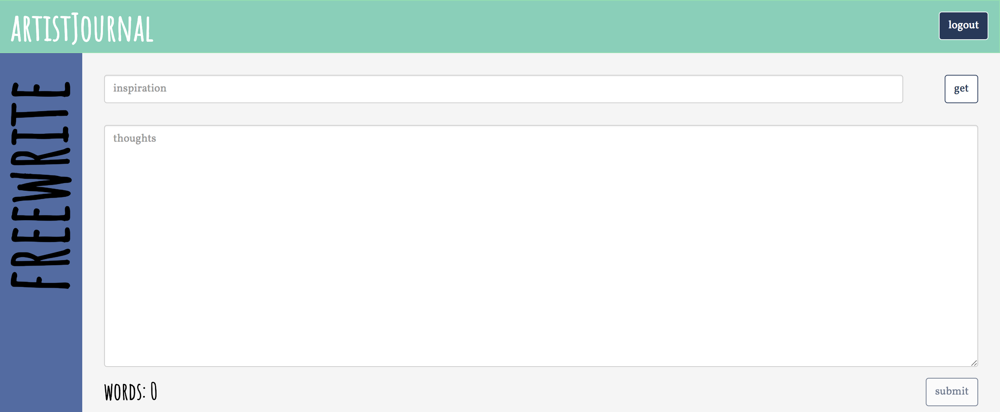
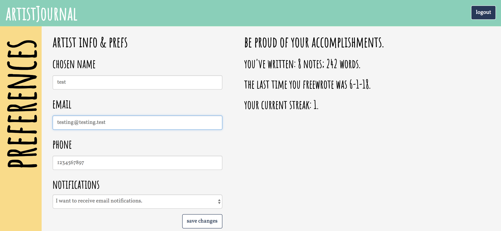

# artistJournal

This project was born out of a want to create an application for the benefit of artists. 
Plenty of apps exist for the purpose of commoditizing art or profiting off of artists' creations, but there aren't many that are designed with the sole purpose of helping artists achieve their goals.
With that in mind, artistJournal was created to help artists in their creation process through freewriting. What that means:
1) It's designed for artists. Nowhere, in the app or in the app's proprietary code, will you find the word "user." It seems like a semantic choice, but "user" evokes feelings of addiction. Art is the opposite of addiction; art is freedom. Folks freewriting in artistJournal are not "users"; they are artists.
2) It's designed to inspire. Artists who feel stuck can click a button to get an oblique strategy to help them move forward. Learn more on oblique strategies here: https://en.wikipedia.org/wiki/Oblique_Strategies.
3) It's designed to increase discipline. Artists who opt in receive daily email notifications reminding them to freewrite. These reminders are there to help nudge artists who may be getting distracted with the day-to-day monotony. To remind them they are an artist and to remind them to create.

## Preview

### Main Journal Page

#### Inspiration

### Expanded Journal Pad

### Artist Preferences

## Deployment

This project is deployed to Heroku [here](http://artistjournal.herokuapp.com/).

## Built With

* React.js
* React Router
* Node.js
* Nodecron
* Nodemailer
* [Bootstrap](https://getbootstrap.com/docs/3.3/) - CSS library

## Authors

* **Joe Fitzpatrick** - [GitHub](https://github.com/joefitz12)

## License

This project is licensed under the MIT License - see the [LICENSE.md](LICENSE.md) file for details

## Acknowledgments

* Thanks to Bob Ross and [Bob Ross Lorem Ipsum](http://www.bobrosslipsum.com/) for providing fun text to use for my screenshots!
